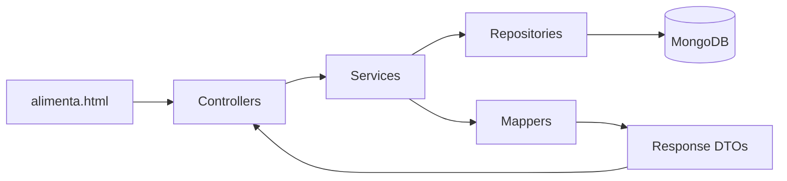

# Arquitetura do Alimenta

## Casos de uso e orientação a objetos

O operador registra pontos e doações por uma interface que consome a API com `fetch`.
Controllers recebem DTOs validados, delegam ao Service e definem status HTTP. Services
coordenam regras e persistência. Repositories estendem Spring Data, sem regras de negócio.
Mappers convertem explicitamente documentos e contratos. Composição e injeção por
construtor permitem substituir dependências nos testes. Records representam valores
imutáveis; documentos persistidos não são usados como contratos HTTP.



## Modelagem NoSQL — requisitos de 2026.2

Foi adotada a opção mais exigente do enunciado: múltiplas coleções relacionadas e
documentos complexos, apesar da referência ambígua a primeiro/segundo semestre.

`pontos_coleta` contém `_id`, `nome` e `endereco` aninhado:

```json
{"_id":"ponto-exemplo","nome":"Centro comunitário",
 "endereco":{"rua":"Rua Exemplo, 100","bairro":"Centro","cidade":"Maringá","estado":"PR"}}
```

`doacoes` referencia `pontos_coleta._id` por `pontoColetaId`, com lista de subdocumentos:

```json
{"_id":"doacao-exemplo","pontoColetaId":"ponto-exemplo","doador":"Mercado demonstração",
 "validade":"2026-12-31",
 "itens":[{"nome":"Arroz","quantidade":5,"unidade":"kg"},{"nome":"Feijão","quantidade":3,"unidade":"kg"}]}
```

São representações legíveis: Spring Data grava `LocalDate` como data BSON e pode
adicionar `_class`. A API expõe `id`, não `_id`; o identificador é gerado na persistência.
Um ponto tem muitas doações. A referência evita repetir o endereço em cada lote;
os itens são embutidos porque pertencem ao lote e são consultados juntos.
A coleção legada `linguagens` não faz parte do domínio social.

## Contratos

| Recurso | Operações | Respostas |
|---|---|---|
| `/api/pontos-coleta` | GET, POST | 200 lista / 201 com Location |
| `/api/pontos-coleta/{id}` | GET, PUT, DELETE | 200 / 200 / 204 |
| `/api/doacoes` | GET, POST | 200 lista / 201 com Location |
| `/api/doacoes/{id}` | GET, PUT, DELETE | 200 / 200 / 204 |

Corpos: consulte `/v3/api-docs` ou `/docs`. POST e PUT têm DTOs independentes.
Entradas inválidas retornam 400 com `fieldErrors`, incluindo `itens[0].quantidade`
e `endereco.rua`. Recursos ausentes retornam 404; conflitos de negócio, 409.
Formato de erro: `status`, `error`, `message`, `path`, `fieldErrors`.

Validade é a menor data entre os alimentos do lote. O dia atual é aceito; datas
anteriores são bloqueadas pelo Service. Um `Clock` em America/Sao_Paulo permite testes
determinísticos. Quantidades são inteiras positivas; unidades: `kg`, `litro`, `unidade`.

## Decisões e limites

- Reutilização da arquitetura do projeto-base, sem novo framework.
- PoC local de operador único, sem autenticação ou cadastro de famílias.
- Até 20 itens por lote. Não há avaliação sanitária automática ou impacto social medido.
- MongoDB não tem chave estrangeira: a aplicação valida a existência do ponto.
  Checagem de vínculos e exclusão do ponto são operações separadas. Não há garantia
  transacional entre coleções sob exclusão/criação concorrentes. Uma implantação com
  vários operadores deve usar transações ou desativação de pontos.
